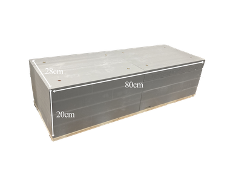
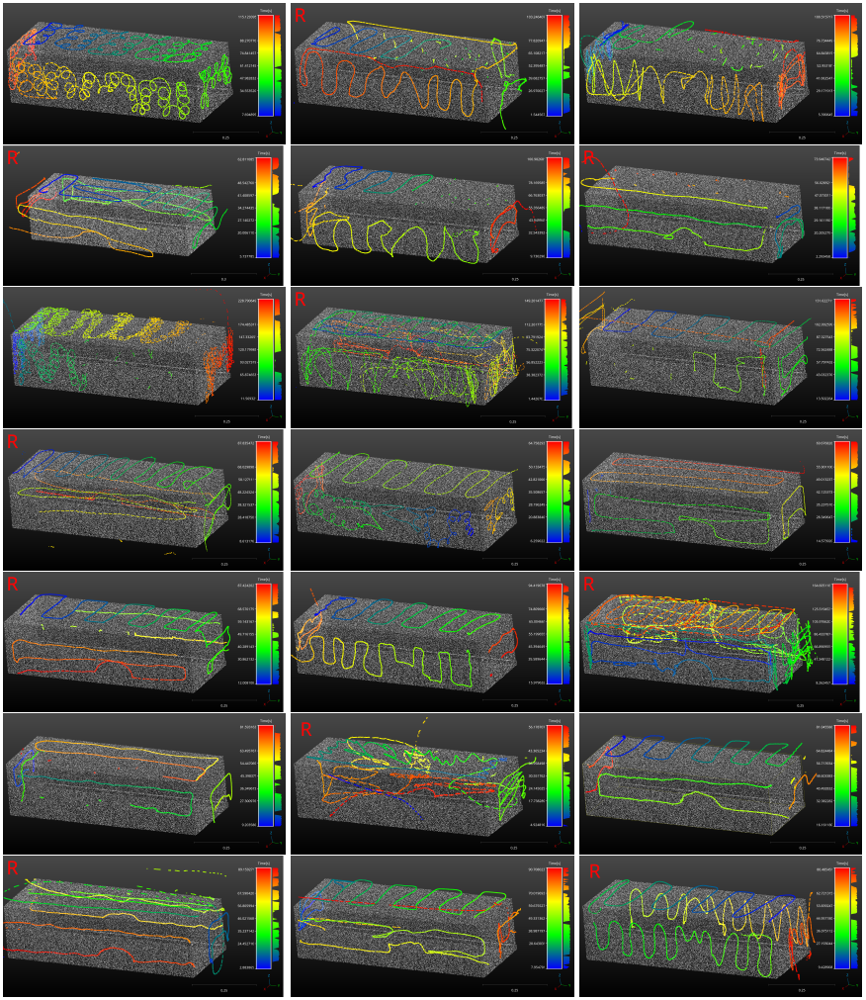
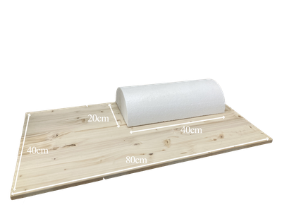
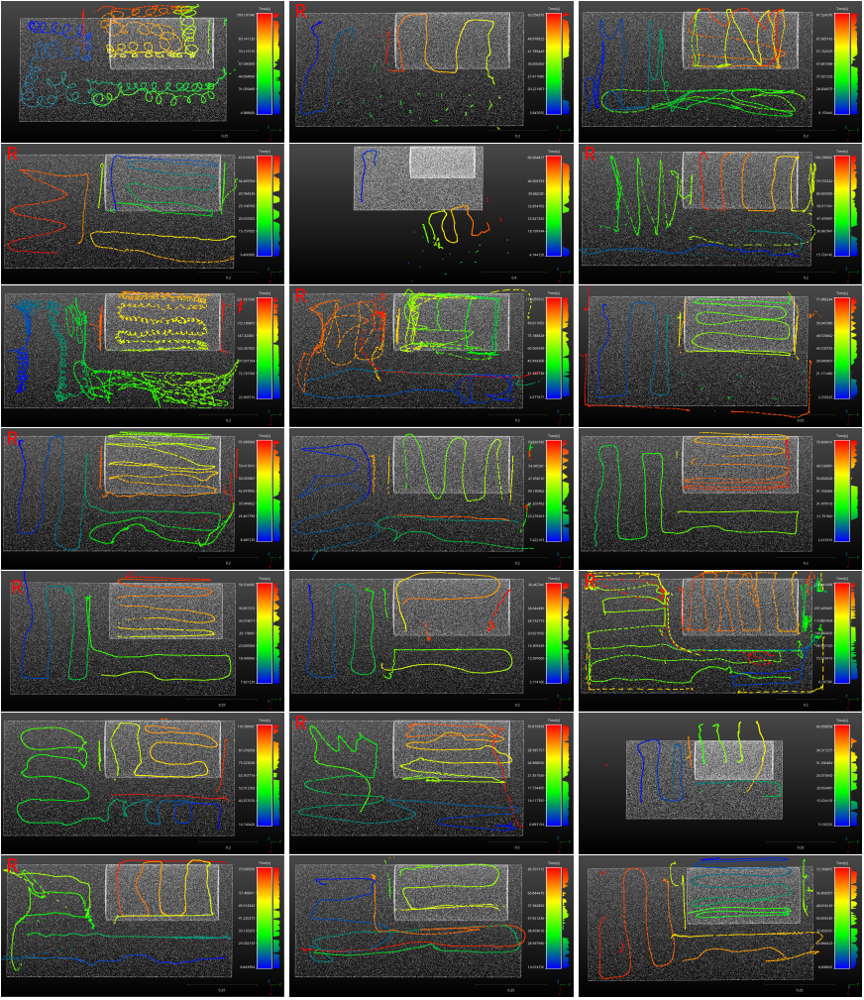
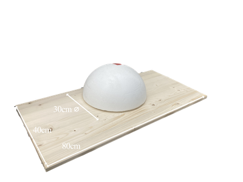
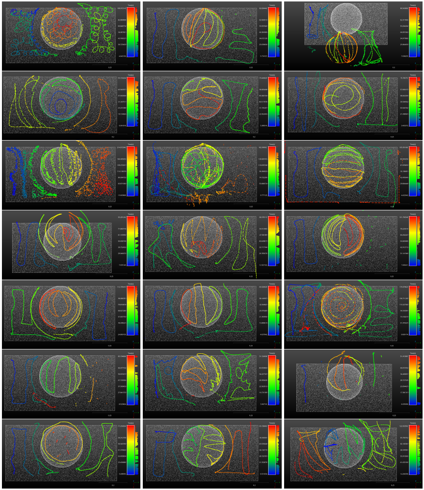
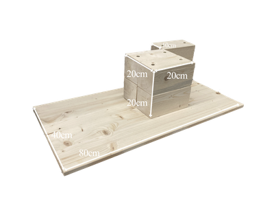
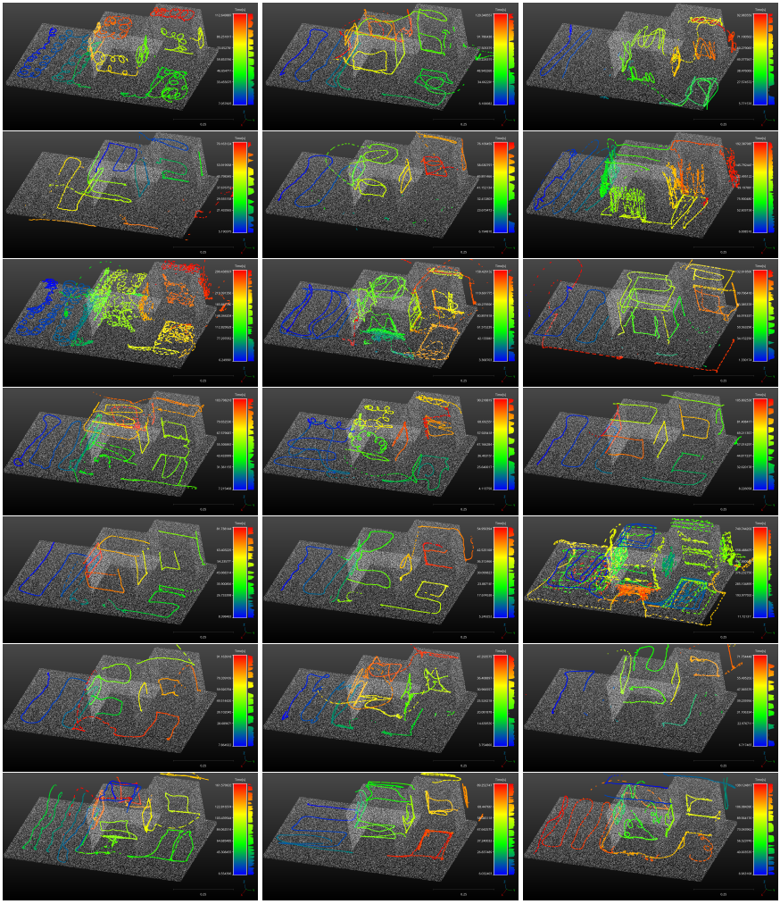

## Download

https://zenodo.org/records/16536274

## Description

The dataset contains videos, motions, and forces of 21 human subjects of surface processing demonstrations applied on 4 different workpieces using a powered sanding tool.

A description about data dimensions and a python script to read the dataset can be found here:
* [read_data.py](https://github.com/teiband/SURP/blob/main/read_data.py)

### Box

#### Model



#### Demonstrations



### Cylinder

#### Model


#### Demonstrations



### Sphere

#### Model


#### Demonstrations



### Wood Corners

#### Model


#### Demonstrations



## Reference

You can find more information in the reference. Please consider citing it if you find it useful for your research.
```
@InProceedings{,
  author    = {Eiband, Thomas and Leimbach, Lars and Nottensteiner, Korbinian and Albu-Schäffer, Alin},
  booktitle = {IEEE/RSJ International Conference on Intelligent Robots and Systems (IROS)},
  title     = {Extraction of robotic surface processing strategies from human demonstrations},
  year      = {2025},
  pages     = {(under review)},
}
```
